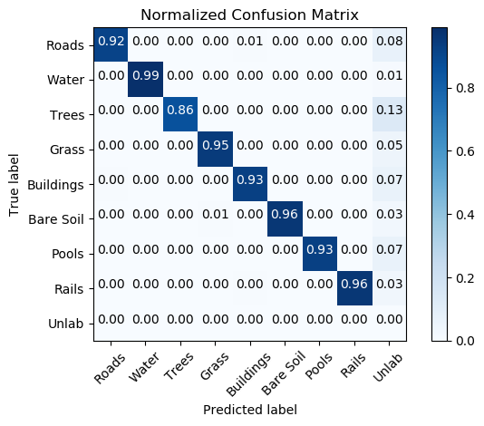
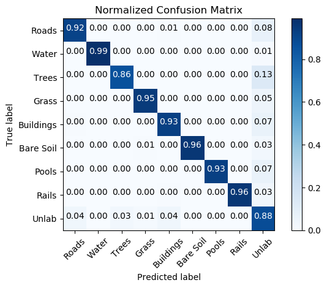

# The Eye in the Sky
This is the repository for the problem statement *The Eye in the Sky* for the Inter IIT Tech Meet 2018 at IIT Bombay.
The approach used is: [Interactive Medical Image Segmentation using Deep Learning with Image-specific Fine-tuning](http://discovery.ucl.ac.uk/10032237/7/David_08270673.pdf) by Wang et al.

## Pre-Requisites
1. Download the dataset.
2. Install the python packages:
  ```
  pip install -r requirements.txt
  ```
3. Run the command:
  ```
  ./dataset_rot.py --data-path /path/to/train/dataset
  ```

## Instructions
### Retraining the best model
```
./best_model.py --data-path /path/to/train/dataset --save-dir /path/where/model/is/to/be/saved
```

### Reproducing the best model results
```
./evaluate.py --data-path /path/to/train/dataset --save-dir /path/where/model/is/saved
```
**NOTE**: The evaluation is done by excluding those pixels which are white in the target segmentation.
In order to include those pixels, use the `--include-white` argument.

### Getting predictions for test data
```
./inference.py --data-path /path/to/test/dataset --save-dir /path/where/model/is/saved
```

## Results
The following results were obtained by keeping "8.tif", "11.tif" and "12.tif" as test data, and training on the remaining images from the training dataset.

### Excluding White pixels
* Accuracy: 92.45%
* Cohen's Kappa: 0.9026



### Including White pixels
* Accuracy: 90.68%
* Cohen's Kappa: 0.8776



Output images by inference on the test dataset are present in [this directory](./test_results).

## Info
All python scripts are executable and use argparse for commandline arguments. More info about a script's arguments can be obtained by:
```
./script.py -h
```
Docstrings are provided for almost all public functions and classes for further info.
